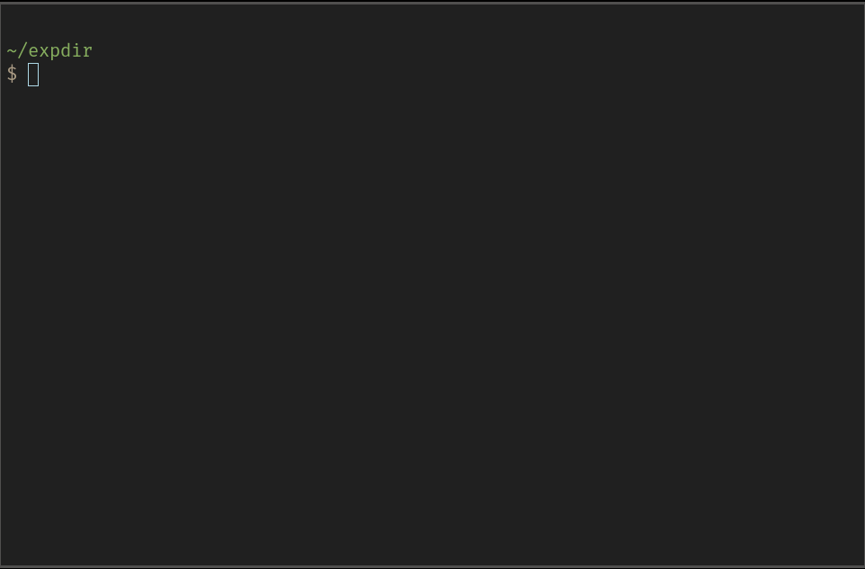

# Demo


# Installation

1. Clone the repo:
```git clone git@github.com:ludvikn/zsh_recent_files.git```
 
2. Source the plugin in your ```.zshrc``` to enable the plugin:
```source <path_to_zsh_recents>/main.zsh```

3. Edit the variable ```ZSH_RECENTS``` in ```main.zsh``` to contain 
   the directory path of your zsh_recents installation.

